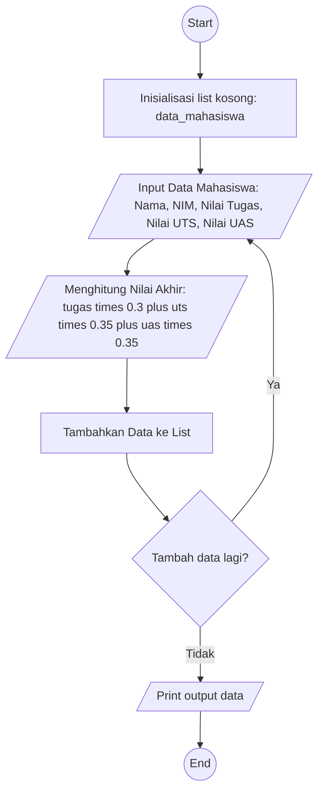

# PRAKTIKUM 4




# Program Input dan Output Data Mahasiswa
Program ini merupakan aplikasi sederhana berbasis konsol untuk mencatat data mahasiswa dan menampilkan hasilnya dalam bentuk tabel. Setiap mahasiswa memiliki informasi berupa nama, NIM, nilai tugas, nilai UTS, nilai UAS, dan nilai akhir yang dihitung berdasarkan bobot tertentu.

### Fitur Utama:
1. Input Data Mahasiswa:
   - Pengguna dapat memasukkan nama, NIM, nilai tugas, UTS, dan UAS.
   - Nilai akhir dihitung otomatis dengan rumus:
                 Nilai Akhir=(Tugas×0.3)+(UTS×0.35)+(UAS×0.35)
2. Penyimpanan Data:
   - Data yang dimasukkan akan disimpan dalam daftar (```list```) dengan struktur berupa dictionary untuk setiap mahasiswa.
3. Tampilan Data:
   - Setelah input selesai, semua data ditampilkan dalam bentuk tabel dengan kolom berisi nomor, nama, NIM, nilai tugas, UTS, UAS, dan nilai akhir.
4. Pilihan Berhenti:
   - Pengguna dapat memilih untuk menambah data baru atau menghentikan program dengan mengetik ```y``` (ya) atau ```t ```(tidak).

### Struktur Kode:
1. Inisialisasi List Data Mahasiswa:
   - ```data_mahasiswa = []``` digunakan untuk menyimpan seluruh data mahasiswa yang dimasukkan.
2. Pengumpulan Data:
   - Program berjalan dalam loop ```while True``` untuk memungkinkan input data secara berulang.
   - Input data mencakup nama, NIM, nilai tugas, UTS, dan UAS.
3. Perhitungan Nilai Akhir:
   - Nilai akhir dihitung menggunakan formula yang memberikan bobot:
   - 30% untuk nilai tugas.
   - 35% untuk nilai UTS.
   - 35% untuk nilai UAS.
4. Menambah Data ke List:
   - Setiap data mahasiswa ditambahkan ke dalam list ```data_mahasiswa``` sebagai dictionary menggunakan metode ```append```.
5. Tampilan Akhir:
   - Setelah loop selesai, data ditampilkan dalam format tabel menggunakan ```print``` dengan lebar kolom yang disesuaikan agar lebih rapi.

## Contoh Kode
```python
data_mahasiswa = []

while True:
    print("="*23)
    print("Masukkan Data Mahasiswa")
    print("="*23)
    nama = input("Nama: ")
    nim = input("NIM: ")
    tugas = float(input("Nilai Tugas: "))
    uts = float(input("Nilai UTS: "))
    uas = float(input("Nilai UAS: "))

    nilai_akhir = (tugas * 0.3) + (uts * 0.35) + (uas * 0.35)

    data_mahasiswa.append({
        "nama": nama,
        "nim": nim,
        "tugas": tugas,
        "uts": uts,
        "uas": uas,
        "nilai_akhir": nilai_akhir
    })

    tambah_data = input("Tambah Data(y/t)? ")
    if tambah_data == 't':
        break

# Lebar kolom untuk setiap data
print("=" * 95)
print(f"{'No'.center(5)}|{'Nama'.center(15)}|{'NIM'.center(10)}|{'Nilai Tugas'.center(13)}|{'Nilai UTS'.center(10)}|{'Nilai UAS'.center(10)}|{'Nilai Akhir'.center(10)}")
print("=" * 95)

for i, mhs in enumerate(data_mahasiswa, start=1):
    print(f"{str(i).center(5)}|{mhs['nama'].center(15)}|{mhs['nim'].center(10)}|{str(mhs['tugas']).center(13)}|{str(mhs['uts']).center(10)}|{str(mhs['uas']).center(10)}|{format(mhs['nilai_akhir'], '.2f').center(10)}")

```

## Contoh Output


## Catatan: 
- Format tabel disesuaikan agar data lebih mudah dibaca.
- Nilai akhir ditampilkan dengan dua angka desimal menggunakan ```format(nilai_akhir, '.2f')```.
